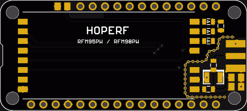

# RFM98PW Wing

This is an Adafruit Feather (TM) compatible Wing for the RFM98PW LoRa radio module by HopeRF that works at 169MHz.

## Images

## License

This design is under [CreativeCommons Attribution-ShareAlike 4.0 International License](https://choosealicense.com/licenses/cc-by-sa-4.0).